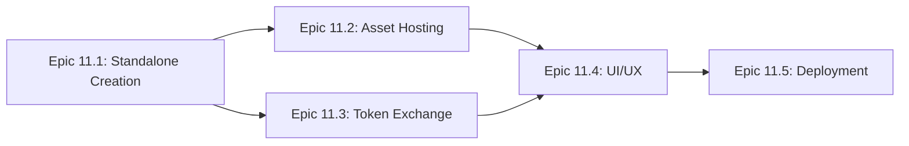

## Initiative 11: Discord Activity Integration (INIT-011)
**Status:** Not Started
**Dependencies:** INIT-003 (Rendering/Graphics)
**Outcome:** Standalone Model Viewer accessible as an embedded Discord Activity via slash command

---

### ⚠️ CRITICAL CONSTRAINT: ZERO ENGINE MODIFICATIONS

**THIS IS A COMPLETELY SEPARATE STANDALONE PROJECT.**

- **ZERO** modifications to any Miskatonic Engine code
- The engine's `model-viewer.ts` remains **COMPLETELY UNTOUCHED**
- The engine's `model-viewer.html` remains **COMPLETELY UNTOUCHED**
- **NO refactoring, NO abstractions, NO "improvements"** to existing engine code
- May **IMPORT FROM** `@miskatonic/rendering` as a read-only dependency
- May **COPY** rendering code if needed, but **NEVER MODIFY** originals

**The Discord Activity is an independent project that happens to use the same rendering libraries.**

---

### Overview

Create a **NEW standalone model viewer** for Discord Activity, allowing users to launch an interactive 3D model viewer directly within Discord channels. Similar to how Wordle is embedded in Discord, users will access the viewer via slash command or the Activity Launcher.

This standalone viewer will:
- Import from `@miskatonic/rendering` package (OBJ loading, WebGPU backend)
- Be built from scratch without Electron dependencies
- Live in a separate project directory (not modifying engine packages)
- Have its own entry points, build config, and deployment

### Epic Sequencing & Dependencies



**Critical Path**: Epic 11.1 → Epic 11.2 & 11.3 (parallel) → Epic 11.4 → Epic 11.5

**Parallelization Opportunities**:
- Epic 11.2 (Asset Hosting) and Epic 11.3 (Token Exchange) can be developed in parallel
- UI mockups for Epic 11.4 can begin during Epic 11.1
- Legal documentation for Epic 11.5 can be drafted early

### Technical Foundation

**Discord Environment:**
- Discord uses Electron with modern Chromium
- WebGPU is fully supported (no WebGL2 fallback needed)
- Activities run in sandboxed iframes with strict CSP
- All external requests must go through Discord's proxy system

**Reusable from @miskatonic/rendering (import as dependency):**
- OBJ loader uses `fetch()` - can import directly
- WebGPU backend abstraction - can import directly
- ECS components (Camera, Transform) - can import directly
- Shader files and post-processing - can import directly

**Must Build New (standalone project):**
- Model viewer UI and controls
- Discord SDK integration
- Asset loading from CDN
- All entry points and build configuration

### Epic 11.1: Standalone Viewer Creation & SDK Integration
**Priority:** P0
**Status:** Not Started
**Acceptance Criteria:**
- NEW standalone model viewer runs in Discord iframe
- Discord Embedded App SDK properly initialized and authenticated
- OAuth2 flow completes with proper scope permissions
- WebGPU rendering pipeline (imported from @miskatonic/rendering) works in Discord environment
- No console errors or CSP violations
- **ZERO modifications to any existing Miskatonic Engine files**

#### User Stories:
1. **As a Discord user**, I want to launch the model viewer from a slash command
2. **As a developer**, I want proper authentication with Discord OAuth2
3. **As a user**, I want the viewer to load without errors in Discord

#### Prerequisites:
- [ ] Verify packages/rendering exports loadOBJWithMaterials function
- [ ] Confirm WebGPU support in Discord's embedded Chromium

#### Tasks Breakdown:

##### Project Setup
- [ ] Create new project directory: `discord-model-viewer/` (separate from engine)
- [ ] Initialize npm project with TypeScript and Vite
- [ ] Add `@miskatonic/rendering` as dependency (npm link or copy)
- [ ] Install `@discord/embedded-app-sdk` package
- [ ] Configure TypeScript with Discord SDK types
- [ ] Setup Vite build configuration for standalone deployment

##### Create Standalone Viewer
- [ ] Create `index.html` with canvas and UI controls
- [ ] Create `src/main.ts` as entry point
- [ ] Create `src/DiscordModelViewer.ts` - new viewer class that:
  - Imports from @miskatonic/rendering (loadOBJWithMaterials, WebGPUBackend, etc.)
  - Implements model loading via fetch() from CDN URLs
  - Implements texture loading via fetch() from CDN URLs
  - Has NO Electron IPC dependencies (built without them)
- [ ] Create `src/ui/` directory for control panel components
- [ ] Create model selector dropdown (no file picker - Discord doesn't allow local files)

##### Discord SDK Integration
- [ ] Implement DiscordSDK initialization with proper client ID configuration
- [ ] Add ready() check before initializing ModelViewer
- [ ] Implement authenticate() with proper OAuth2 scopes (identify, guilds.members.read)
- [ ] Implement authorize() for initial permissions
- [ ] Add error handling for SDK initialization failures
- [ ] Store access token securely for API calls

##### WebGPU Compatibility
- [ ] Add WebGPU capability check before initialization
- [ ] Create fallback UI for unsupported browsers with update instructions
- [ ] Verify GPU adapter request works in Discord iframe
- [ ] Test that all WebGPU features used are available in Discord

##### Environment Configuration
- [ ] Add VITE_DISCORD_CLIENT_ID to .env.example
- [ ] Create development vs production SDK configuration
- [ ] Setup CSP-compliant asset loading patterns

##### Testing and Validation
- [ ] Test with cloudflared tunnel for HTTPS development
- [ ] Verify no Electron API calls remain in bundle
- [ ] Test OAuth flow completion
- [ ] Validate rendering performance matches standalone version
- [ ] Document Discord-specific setup instructions

#### Implementation Examples:

**Discord SDK Initialization (src/main.ts):**
```typescript
import { DiscordSDK } from '@discord/embedded-app-sdk';
import { DiscordModelViewer } from './DiscordModelViewer';

const discordSdk = new DiscordSDK(import.meta.env.VITE_DISCORD_CLIENT_ID);

async function initializeActivity() {
  // Wait for Discord SDK to be ready
  await discordSdk.ready();

  // Authenticate user
  const { code } = await discordSdk.commands.authorize({
    client_id: import.meta.env.VITE_DISCORD_CLIENT_ID,
    response_type: 'code',
    scope: ['identify', 'guilds.members.read'],
  });

  // Exchange code for token via backend
  const response = await fetch('/api/token', {
    method: 'POST',
    headers: { 'Content-Type': 'application/json' },
    body: JSON.stringify({ code }),
  });

  const { access_token } = await response.json();

  // Authenticate SDK with token
  await discordSdk.commands.authenticate({ access_token });

  // Initialize standalone model viewer
  const viewer = new DiscordModelViewer('canvas');
  await viewer.initialize();
}

initializeActivity().catch(console.error);
```

**Standalone Viewer Class (src/DiscordModelViewer.ts):**
```typescript
// Import rendering utilities from @miskatonic/rendering (as read-only dependency)
import { loadOBJWithMaterials, WebGPUBackend } from '@miskatonic/rendering';

// This is a NEW class - does NOT extend or modify engine's ModelViewer
export class DiscordModelViewer {
  private backend: WebGPUBackend;

  constructor(canvasId: string) {
    const canvas = document.getElementById(canvasId) as HTMLCanvasElement;
    this.backend = new WebGPUBackend();
  }

  async loadModelFromCDN(modelPath: string): Promise<void> {
    // Load from CDN URL - no Electron IPC, just fetch()
    const cdnUrl = `/models/${modelPath}`;
    const modelData = await loadOBJWithMaterials(cdnUrl);
    this.setModelData(modelData);
  }

  // ... rest of viewer implementation built from scratch
}

---

### Epic 11.2: Asset Hosting Infrastructure
**Priority:** P1
**Status:** Not Started
**Acceptance Criteria:**
- CDN bucket configured with proper CORS headers
- All model assets (OBJ, MTL, textures) accessible via HTTPS
- URL mappings properly configured in Discord Developer Portal
- Assets load through Discord proxy without CSP violations
- Load times under 3 seconds for typical models (< 10MB)

#### User Stories:
1. **As a user**, I want models to load quickly from CDN
2. **As a developer**, I want proper CSP compliance for all asset requests
3. **As a system**, I need all URLs mapped through Discord's proxy

#### Prerequisites:
- [ ] Choose CDN provider (Cloudflare R2, AWS S3, or Vercel Blob)
- [ ] Obtain production domain for hosting
- [ ] Create Discord application in Developer Portal

#### Tasks Breakdown:

##### CDN Setup
- [ ] Create storage bucket/container on chosen provider
- [ ] Configure bucket for public read access
- [ ] Set CORS headers to allow Discord origins (`https://discord.com`, `https://discordapp.com`)
- [ ] Enable CDN/edge caching for static assets
- [ ] Configure proper Content-Type headers for OBJ, MTL, PNG, JPG files

##### Asset Organization
- [ ] Create folder structure: `/models/{model-name}/` with model.obj, materials.mtl, textures/
- [ ] Convert large textures to optimized formats (max 2048x2048)
- [ ] Create manifest.json listing available models with metadata
- [ ] Upload sample models with proper directory structure:
  - [ ] Naked Snake (/models/naked-snake/)
  - [ ] Tallgeese III (/models/tallgeese-iii/)
  - [ ] Kid Goku (/models/kid-goku/)
  - [ ] Hatsune Miku (/models/hatsune-miku/)
  - [ ] Patriot (/models/patriot/)
  - [ ] High-Tech Soldier (/models/high-tech-soldier/)

##### Discord URL Mapping Configuration
- [ ] Map `/` to Activity hosting URL (e.g., `https://your-app.vercel.app`)
- [ ] Map `/models` to CDN URL (e.g., `https://your-bucket.r2.cloudflarestorage.com/models`)
- [ ] Map `/api` to backend Worker URL for token exchange
- [ ] Test each mapping with Discord's proxy validator

##### Code Integration
- [ ] Implement `patchUrlMappings()` helper using Discord SDK
- [ ] Create `ModelRegistry` class to manage available models from manifest
- [ ] Update loadModelFromURL to use mapped CDN paths
- [ ] Add progress indicators for model downloads
- [ ] Implement retry logic for failed asset loads
- [ ] Add caching headers to reduce repeated downloads

##### Performance Optimization
- [ ] Implement progressive loading (show model before textures)
- [ ] Add model complexity warnings for large files
- [ ] Consider implementing LOD (Level of Detail) system
- [ ] Preload commonly used textures

##### Testing
- [ ] Test all models load correctly through Discord proxy
- [ ] Verify no CORS errors in console
- [ ] Check load times meet performance criteria
- [ ] Test with slow network conditions
- [ ] Validate CSP compliance with Discord's requirements

#### URL Mapping Configuration:
```
Developer Portal > Application > Activities > URL Mappings:
/ -> https://your-activity-host.com
/models -> https://your-bucket.r2.cloudflarestorage.com/models
/textures -> https://your-bucket.r2.cloudflarestorage.com/textures
/api -> https://your-api-worker.workers.dev
```

---

### Epic 11.3: Backend Token Exchange Service
**Priority:** P1
**Status:** Not Started
**Acceptance Criteria:**
- Secure token exchange endpoint deployed and accessible
- Client secret never exposed to frontend
- Proper error handling with meaningful error codes
- Request logging for debugging OAuth issues
- CORS properly configured for Discord origins
- Response times under 500ms

#### User Stories:
1. **As a system**, I need to securely exchange OAuth codes for access tokens
2. **As a developer**, I want proper error handling for auth failures
3. **As a security measure**, client secrets must never be exposed to frontend

#### Prerequisites:
- [ ] Cloudflare account with Workers enabled
- [ ] Discord application Client ID and Client Secret
- [ ] Understanding of OAuth2 authorization code flow

#### Tasks Breakdown:

##### Worker Project Setup
- [ ] Create new Cloudflare Worker project using Wrangler CLI
- [ ] Configure TypeScript for type safety
- [ ] Setup local development environment with miniflare
- [ ] Create wrangler.toml with proper environment configuration

##### Token Exchange Implementation
- [ ] Implement POST `/api/token` endpoint
- [ ] Validate request body for required `code` parameter
- [ ] Construct Discord token exchange request with proper headers
- [ ] Handle Discord API responses (success and error cases)
- [ ] Implement request timeout handling (max 5 seconds)
- [ ] Add input validation to prevent injection attacks

##### Security Configuration
- [ ] Store DISCORD_CLIENT_ID in Worker environment variables
- [ ] Store DISCORD_CLIENT_SECRET in Worker secrets (wrangler secret)
- [ ] Implement rate limiting (max 10 requests per minute per IP)
- [ ] Add request origin validation
- [ ] Ensure all responses use proper security headers

##### CORS Configuration
- [ ] Allow origins: `https://discord.com`, `https://discordapp.com`, `https://ptb.discord.com`, `https://canary.discord.com`
- [ ] Allow methods: POST, OPTIONS
- [ ] Handle preflight OPTIONS requests properly
- [ ] Set appropriate Access-Control headers

##### Error Handling
- [ ] Define error response format with error codes
- [ ] Handle network failures to Discord API
- [ ] Handle invalid authorization codes
- [ ] Handle rate limiting from Discord
- [ ] Return user-friendly error messages
- [ ] Log errors with context for debugging

##### Logging and Monitoring
- [ ] Implement structured logging with request IDs
- [ ] Log successful token exchanges (without sensitive data)
- [ ] Log error cases with full context
- [ ] Set up Cloudflare Analytics dashboard
- [ ] Configure alerts for high error rates

##### Testing
- [ ] Write unit tests for token exchange logic
- [ ] Test with valid Discord authorization codes
- [ ] Test error cases (invalid code, network failure)
- [ ] Test CORS headers with different origins
- [ ] Load test to ensure performance targets

##### Deployment
- [ ] Deploy to Cloudflare Workers staging environment
- [ ] Test end-to-end OAuth flow with Discord
- [ ] Deploy to production with zero downtime
- [ ] Verify production secrets are configured
- [ ] Document API endpoint and expected responses

#### Backend Implementation:
```typescript
// Cloudflare Worker for token exchange
export default {
  async fetch(request: Request) {
    if (request.url.endsWith('/api/token')) {
      const { code } = await request.json();
      const response = await fetch('https://discord.com/api/oauth2/token', {
        method: 'POST',
        headers: { 'Content-Type': 'application/x-www-form-urlencoded' },
        body: new URLSearchParams({
          client_id: DISCORD_CLIENT_ID,
          client_secret: DISCORD_CLIENT_SECRET,
          grant_type: 'authorization_code',
          code,
        }),
      });
      return response;
    }
  }
};
```

---

### Epic 11.4: UI/UX Adaptation for Discord
**Priority:** P2
**Status:** Not Started
**Acceptance Criteria:**
- UI properly sized for Discord Activity modal (default 960x540, resizable)
- Model selector populated from CDN manifest
- Touch controls work on mobile Discord app
- Participant awareness shows active viewers
- Controls responsive and accessible

#### User Stories:
1. **As a user**, I want to select models from a curated list
2. **As a mobile user**, I want touch controls that work well
3. **As a participant**, I want to see who else is viewing the model
4. **As a user**, I want the UI to fit well in Discord's Activity modal

#### Prerequisites:
- [ ] Understand Discord Activity viewport constraints
- [ ] Review Discord's UI/UX guidelines for Activities
- [ ] Test environment with mobile Discord app

#### Tasks Breakdown:

##### UI Layout Adaptation
- [ ] Remove file picker button and related UI elements
- [ ] Redesign control panel for 960x540 minimum viewport
- [ ] Make canvas responsive to Activity resize events
- [ ] Adjust font sizes and spacing for readability
- [ ] Create collapsible panels for controls on small screens
- [ ] Implement proper overflow handling for control lists

##### Model Selection Interface
- [ ] Replace file picker with dropdown populated from CDN manifest
- [ ] Add model preview thumbnails in dropdown
- [ ] Show model metadata (polygon count, texture size)
- [ ] Implement search/filter for model list
- [ ] Add loading state while fetching manifest
- [ ] Cache manifest data for quick access

##### Mobile Touch Controls
- [ ] Detect touch device capability
- [ ] Implement single-finger rotation (orbit camera)
- [ ] Implement two-finger pinch zoom
- [ ] Implement two-finger pan
- [ ] Add touch gesture indicators/tutorial
- [ ] Prevent default browser gestures in canvas area
- [ ] Test on iOS and Android Discord apps

##### Participant Awareness
- [ ] Create participant list UI component
- [ ] Fetch participants using `discordSdk.commands.getInstanceConnectedParticipants()`
- [ ] Display participant avatars and usernames
- [ ] Update list when participants join/leave
- [ ] Show participant count in UI header
- [ ] Add "viewing same model" indicator

##### Synchronized Viewing (Stretch Goal)
- [ ] Implement shared camera state using Discord SDK commands
- [ ] Add "sync view" toggle button
- [ ] Broadcast camera position to other participants
- [ ] Smooth interpolation for received camera updates
- [ ] Add presenter mode (one person controls view)

##### Visual Polish
- [ ] Match Discord's dark theme colors
- [ ] Add smooth transitions for UI state changes
- [ ] Implement proper focus states for keyboard navigation
- [ ] Add tooltips for all controls
- [ ] Create custom icons matching Discord's style
- [ ] Add subtle animations for loading states

##### Accessibility
- [ ] Add ARIA labels to all controls
- [ ] Ensure keyboard navigation works properly
- [ ] Add screen reader support for model info
- [ ] Implement high contrast mode support
- [ ] Test with Discord's accessibility features

##### Performance Optimization
- [ ] Lazy load UI components not immediately visible
- [ ] Optimize render loop for mobile devices
- [ ] Reduce polygon count for mobile if needed
- [ ] Implement quality settings (low/medium/high)
- [ ] Monitor frame rate and auto-adjust quality

##### Testing
- [ ] Test on Discord desktop (Windows, Mac, Linux)
- [ ] Test on Discord mobile (iOS, Android)
- [ ] Test on Discord web browser version
- [ ] Verify UI scales properly at different sizes
- [ ] Test with multiple participants in same Activity

#### Participant Awareness:
```typescript
// Get current participants
const participants = await discordSdk.commands.getInstanceConnectedParticipants();
// Display in UI
updateParticipantList(participants);
```

---

### Epic 11.5: Production Deployment & Discord Verification
**Priority:** P2
**Status:** Not Started
**Acceptance Criteria:**
- Activity deployed to production with HTTPS
- All legal requirements met (Privacy Policy, ToS)
- Support infrastructure established
- Discord verification process completed
- Activity discoverable in App Directory
- Zero critical bugs in production

#### User Stories:
1. **As a user**, I want the Activity to be discoverable in the App Directory
2. **As Discord**, I need proper legal documents and support channels
3. **As a developer**, I want the app verified for wider distribution

#### Prerequisites:
- [ ] All previous epics completed and tested
- [ ] Production hosting account ready
- [ ] Domain name registered
- [ ] Stripe account for identity verification

#### Tasks Breakdown:

##### Production Build Optimization
- [ ] Configure production build settings in Vite
- [ ] Enable minification and tree-shaking
- [ ] Optimize bundle size (target < 500KB gzipped)
- [ ] Generate source maps for error tracking
- [ ] Implement cache busting for assets
- [ ] Add production environment variables

##### Hosting Deployment
- [ ] Choose hosting platform (Cloudflare Pages, Vercel, Netlify)
- [ ] Configure build command and output directory
- [ ] Set up staging environment for testing
- [ ] Configure custom domain with SSL certificate
- [ ] Set up CDN for static assets
- [ ] Configure proper cache headers
- [ ] Enable HTTP/2 or HTTP/3
- [ ] Set up redirect rules (www to non-www, etc.)

##### Legal Documentation
- [ ] Draft Privacy Policy covering:
  - [ ] Data collection practices
  - [ ] Discord user data handling
  - [ ] Cookie usage
  - [ ] Third-party services
  - [ ] User rights (GDPR/CCPA compliance)
- [ ] Draft Terms of Service covering:
  - [ ] Acceptable use policy
  - [ ] Content ownership
  - [ ] Liability limitations
  - [ ] Discord integration terms
- [ ] Host legal pages on same domain
- [ ] Add links to legal pages in Activity UI

##### Support Infrastructure
- [ ] Create support Discord server
- [ ] Set up server structure (channels, roles, rules)
- [ ] Create FAQ channel with common questions
- [ ] Set up ticket system for support requests
- [ ] Assign moderators for server management
- [ ] Create documentation/wiki channel
- [ ] Add invite link to Activity and App Directory

##### Discord Developer Requirements
- [ ] Enable 2FA on Discord developer account
- [ ] Complete Stripe identity verification
- [ ] Upload app icon (512x512px)
- [ ] Create app banner (1920x1080px)
- [ ] Write compelling app description
- [ ] Add screenshots/GIFs of Activity in action
- [ ] Select appropriate categories and tags
- [ ] Configure Activity age rating

##### App Directory Profile
- [ ] Write short description (max 100 characters)
- [ ] Write long description (max 4000 characters)
- [ ] Add feature highlights
- [ ] Upload 5+ high-quality screenshots
- [ ] Create demo video (optional but recommended)
- [ ] Add support server invite link
- [ ] Link Privacy Policy and Terms of Service

##### Pre-Verification Testing
- [ ] Test Activity on all Discord clients
- [ ] Verify OAuth flow works correctly
- [ ] Check all assets load properly
- [ ] Test with different network speeds
- [ ] Verify no console errors in production
- [ ] Test participant features with multiple users
- [ ] Check analytics/monitoring working

##### Discord Verification Process
- [ ] Review Discord's verification checklist
- [ ] Ensure all requirements are met
- [ ] Submit application for verification
- [ ] Respond to any Discord review feedback
- [ ] Make required changes if requested
- [ ] Wait for approval (typically 5-10 business days)

##### Post-Verification Tasks
- [ ] Enable Discovery in App Directory
- [ ] Monitor user feedback and reviews
- [ ] Set up error tracking (Sentry or similar)
- [ ] Configure analytics for usage tracking
- [ ] Plan regular update schedule
- [ ] Create announcement for launch

##### Documentation
- [ ] Create deployment runbook
- [ ] Document environment variables
- [ ] Write troubleshooting guide
- [ ] Create contributor guidelines
- [ ] Document update/rollback procedures

#### Verification Prerequisites:
- Identity verification via Stripe
- 2-Factor Authentication on Discord account
- Privacy Policy and Terms of Service URLs
- Community Support Server
- App description and promotional assets

---

### Environment Configuration

```env
# Frontend (.env)
VITE_DISCORD_CLIENT_ID=your-app-id
VITE_CDN_BASE_URL=https://your-cdn.com

# Backend (Worker secrets)
DISCORD_CLIENT_ID=your-app-id
DISCORD_CLIENT_SECRET=your-secret
```

---

### Development Workflow

```bash
# 1. Install Discord SDK
npm install @discord/embedded-app-sdk

# 2. Start Vite dev server
npm run dev

# 3. Create cloudflared tunnel for HTTPS
cloudflared tunnel --url http://localhost:5173

# 4. Configure tunnel URL in Developer Portal
# Settings > Activities > URL Mappings

# 5. Test in Discord
# Use Activity Launcher or /launch command
```

---

### Technical Considerations

#### Breaking Changes Required
Since this is alpha (v0.x.x), we can make breaking changes:
- ModelViewer class will be refactored to support both Electron and web contexts
- File-based loading methods will be removed entirely (no backwards compatibility)
- New abstraction layer for asset loading will be introduced

#### Cross-Package Dependencies
- **packages/rendering**: Core OBJ/MTL loading, WebGPU backend
- **packages/ecs**: World, Transform, Camera systems
- **packages/renderer**: ModelViewer implementation, UI

#### Performance Requirements
Per project standards:
- **Frame Rate**: 60 FPS target (retro effects may add overhead)
- **Load Time**: < 3 seconds for models under 10MB
- **Memory**: < 500MB for viewer + loaded model
- **Bundle Size**: < 500KB gzipped for Activity code

### Risk Mitigation

| Risk | Impact | Severity | Mitigation |
|------|--------|----------|------------|
| Large model load times | Poor UX | High | Progressive loading, texture compression, CDN edge caching |
| WebGPU not available | Activity won't work | Critical | Feature detection with clear error, fallback instructions |
| CSP violations | Assets won't load | Critical | Thorough URL mapping, test all asset types |
| OAuth flow failures | Can't authenticate | High | Retry logic, clear error messages, fallback auth |
| Mobile performance issues | Poor mobile experience | Medium | Quality settings, reduced poly counts for mobile |
| Participant sync lag | Desync between users | Low | Eventual consistency model, local prediction |

---

### Testing Strategy

#### Unit Testing
- Test Discord SDK wrapper functions in isolation
- Mock Discord API responses for auth flow
- Test model loading with mock fetch responses
- Verify UI component behavior with different states

#### Integration Testing
- Test end-to-end OAuth flow with real Discord app
- Verify CDN asset loading through Discord proxy
- Test participant sync with multiple connected users
- Validate WebGPU rendering in Discord iframe

#### Performance Testing
- Measure frame rates with various model complexities
- Profile memory usage during extended sessions
- Test network performance with throttled connections
- Benchmark mobile device performance

#### Compatibility Testing
- Discord Desktop: Windows 10/11, macOS 12+, Ubuntu 20.04+
- Discord Mobile: iOS 14+, Android 10+
- Discord Web: Chrome 113+, Firefox 113+, Safari 16.4+
- Verify WebGPU support across platforms

### Success Metrics

- **Launch Success Rate**: > 99% successful Activity launches
- **Load Performance**: Models load within 3 seconds from CDN
- **Rendering Performance**: Maintain 60 FPS on target hardware
- **Error Rate**: Zero CSP violations, < 0.1% OAuth failures
- **Verification**: Successfully verified by Discord team
- **User Engagement**: > 50% of users interact for 5+ minutes

---

### Resources

**Official Documentation:**
- [Discord Activities Overview](https://discord.com/developers/docs/activities/overview)
- [Embedded App SDK Reference](https://discord.com/developers/docs/developer-tools/embedded-app-sdk)
- [SDK GitHub Repository](https://github.com/discord/embedded-app-sdk)

**Examples:**
- [Official Starter Template](https://github.com/discord/embedded-app-sdk-examples/tree/main/discord-activity-starter)

**Support:**
- Discord Developers Server: #activities-dev-help
- [Developer Support Portal](https://support-dev.discord.com)
